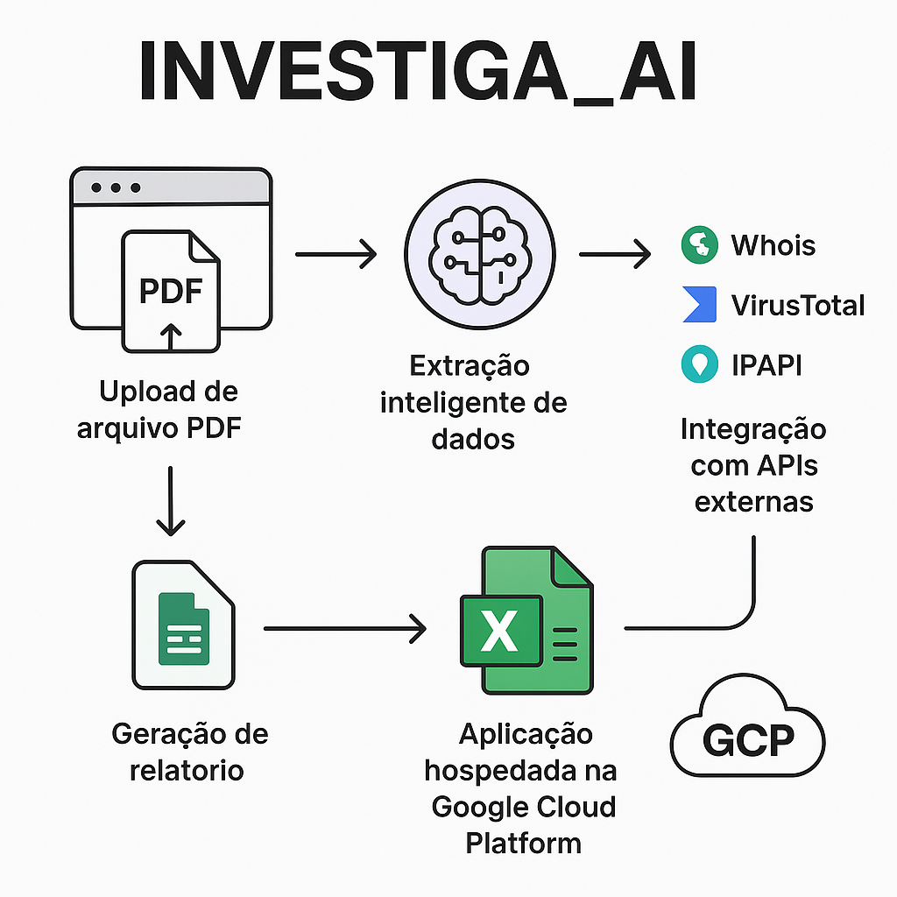

<!-- Topo do README: imagem + título alinhados -->

  
  <h1 style="margin: 0;">INVESTIGA_AI</h1>

**INVESTIGA\_AI** é uma aplicação web desenvolvida para realizar a análise automatizada de endereços IP extraídos de arquivos PDF. O sistema combina tecnologias modernas de backend e frontend, aliadas ao poder de modelos de linguagem, para transformar documentos não estruturados em relatórios analíticos estruturados.

## Funcionalidades

A aplicação INVESTIGA\_AI oferece uma série de funcionalidades automatizadas para facilitar a análise de endereços IP extraídos de documentos. Entre as principais estão:

*  **Upload de arquivos PDF** contendo endereços IP e datas associadas;
*  **Extração inteligente de dados** com uso de RAG via modelo de linguagem (OpenAI API);
*  **Integração com APIs externas** para enriquecer a análise dos IPs:

  * **Whois**: dados de registro e propriedade;
  * **VirusTotal**: detecção de comportamentos maliciosos;
  * **IPAPI**: localização geográfica e informações de rede;
*  **Geração automatizada de relatórios** no formato Excel com todas as informações coletadas;
*  **Aplicação hospedada na Google Cloud Platform (GCP)**, acessível via navegador web;
*  **Interface web intuitiva** e leve, desenvolvida com JavaScript puro.

  

## Tecnologias Utilizadas

### Backend

* **Linguagem:** Python
* **Framework:** [FastAPI](https://fastapi.tiangolo.com/)
* **Servidor ASGI:** [Uvicorn](https://www.uvicorn.org/)
* **Bibliotecas principais:**

  * `openai` (integração com OpenAI API para RAG)
  * `PyPDF2` (extração de texto de arquivos PDF)
  * `langchain` (framework para processamento de linguagem natural)
  * `faiss-cpu` (indexação de dados vetoriais para busca rápida)
  * `selenium` (automação de navegação web, se necessário para consultas externas)
  * `python-multipart` (upload de arquivos)
  * `python-dotenv` (gerenciamento de variáveis de ambiente)
  * `tiktoken` (tokenização de dados para o modelo de linguagem)
  * `openpyxl` (geração de relatórios Excel)
  * `pandas` (manipulação de dados)

### Frontend

* **Linguagem:** JavaScript (ES6+)
* **Markup & Estilo:** HTML5, CSS3
* **Bibliotecas / Plugins:**

  * VanillaJS (manipulação do DOM e comunicação com o backend via Fetch API)

### Infraestrutura & Deploy

* **Plataforma de nuvem:** Google Cloud Platform (GCP)
* **Serviços usados:**

  * Cloud Run (containerização e orquestração)
  * Cloud Storage (armazenamento de arquivos PDF e relatórios)
  * Secret Manager (armazenamento seguro de chaves de API)

### Ferramentas Auxiliares

* **Controle de versão:** Git + GitHub
* **Documentação da API:** OpenAPI (gerada automaticamente pelo FastAPI)
* **CI/CD (opcional):** GitHub Actions

## Como Usar

### 1. Acesse o Site

Acesse a aplicação diretamente no seguinte link:

[https://investiga.seg.br/](https://investiga.seg.br/)

### 2. Fazer o Upload do Arquivo PDF

1. No site, você verá a opção de **upload de um arquivo PDF**.
   Certifique-se de que o arquivo PDF contenha endereços IP, cada um associado a uma data.

### 3. Processamento e Relatório

* **Extração de dados**: A aplicação realizará a extração dos endereços IP e suas respectivas datas do arquivo PDF.
* **Consultas externas**: A aplicação fará chamadas para APIs externas (Whois, VirusTotal e IPAPI) para obter informações sobre os IPs.
* **Geração do relatório**: Após o processamento, um relatório **Excel** será gerado e disponibilizado para download.

### 4. Download do Relatório

Assim que o relatório for gerado, um link de **download** será fornecido para você fazer o download do arquivo Excel com todas as informações coletadas.

## Licença

Este projeto é desenvolvido pela comunidade do **Insper Code** e é de uso livre para fins educacionais e colaborativos. Não está associado a uma licença formal específica.

No entanto, encorajamos o uso responsável e o respeito pelos direitos de propriedade intelectual ao colaborar e contribuir para o projeto.

Caso tenha dúvidas sobre o uso do projeto, entre em contato com a equipe do **Insper Code**.

## Reconhecimento e Colaboração

Este projeto foi desenvolvido pelo **Insper Code**, em colaboração com uma equipe dedicada de desenvolvedores e mentores. A ideia foi inspirada coordenada por **Wesley Alves** e desenvolvida também pelo time **Gabriel Pradyumna** e **Mateus Moreira**.

O projeto foi uma das iniciativas que contribuiram para o artigo publicado na obra *IA por Mulheres*, que foi lançado no Consulado-Geral do Brasil em Boston em 16/04/25. O evento contou com o apoio de **Ana Moura**, especialista em Forense Digital e Investigação Cibernética, e com a presença de figuras ilustres como o cônsul Santiago Mourão, o vice-cônsul Lauro Beltrão e o ministro Eugenio V Garcia.

## Contato

Para mais informações ou para entrar em contato com os responsáveis pelo projeto, você pode acessar os seguintes perfis do LinkedIn:

- [LinkedIn - Insper Code](https://www.linkedin.com/company/insper-code/)
- [LinkedIn - Wesley Alves](https://www.linkedin.com/in/usuario2)
- [LinkedIn - Gabriel Pradyumna](https://www.linkedin.com/in/usuario3)
- [LinkedIn - Mateus Moreira](https://www.linkedin.com/in/usuario4)

